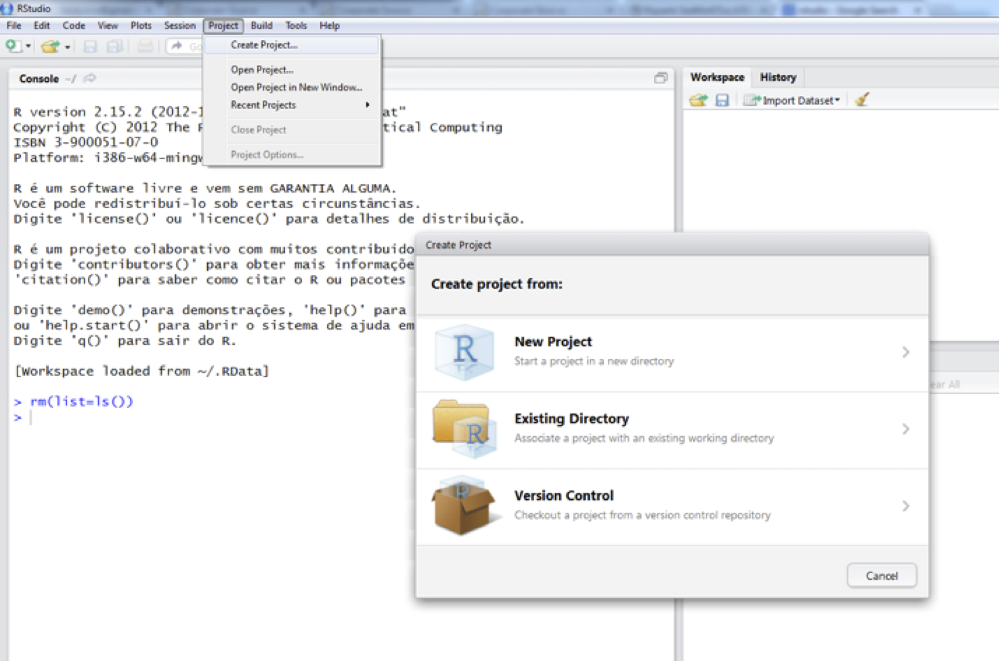
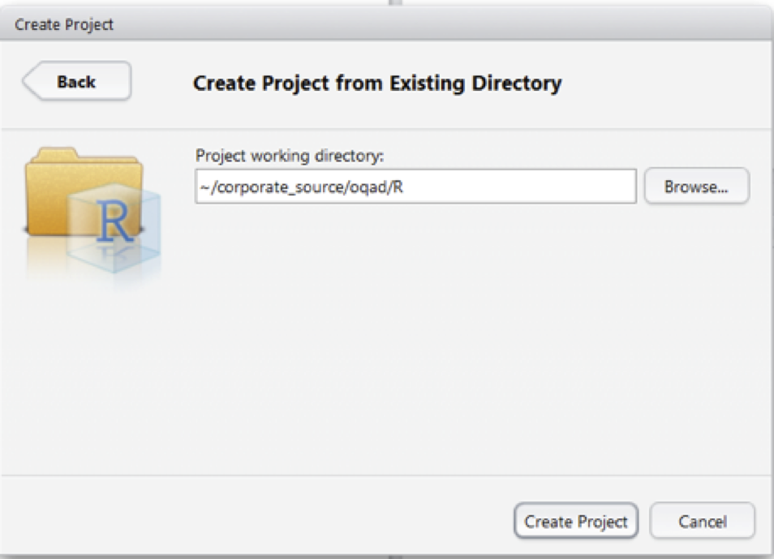
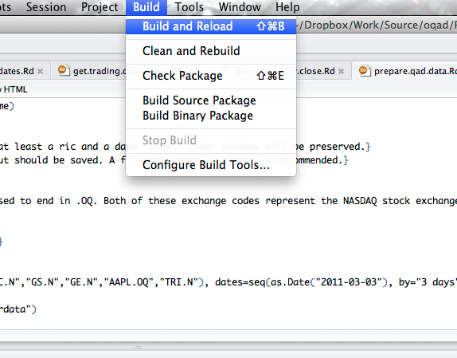
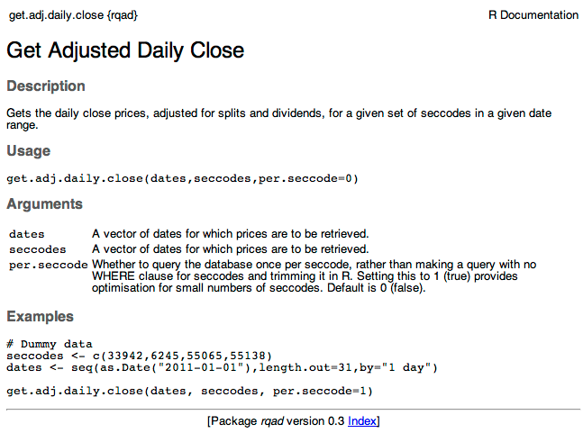

# About RQAD
The RQAD package created by Sameena Shah, Ian MacGillivray and the Quantitative Methods group within Thomson Reuters Corporate R&D.   

## Getting RQAD

RQAD is a part of the Open QAD project.  You can either download a zipfile of all its sources, clone from it from its mercurial repository, or downlaod a pre-built package from CRAN.  

### CRAN

From within R:

	install.packages('rqad')

### From Source


#### OQAD on Github
Link to github here…

	$ git clone https://github.com/thomsonreuters/oqad.git

#### Working with Source Code


##### Directory Structure
```
...
├── R
│   ├── DESCRIPTION <- Instructions for R to build RQAD as a package
│   ├── NAMESPACE <- R 3.0 namespace description
│   ├── R <- RQAD source code
│   ├── README.md <- This README
│   ├── README.pdf<- Static PDF rendering of README.md
│   ├── docs
│   │   ├── QADODBC.md <- ODBC connection setup information
│   │   ├── QADODBC.pdf <- Static PDF rendering of QAODBC.md
│   │   ├── img <- image resources used by documentatoin
│   │   ├── rqad_walkthrough.docx <- User guide, MS Word
│   │   └── rqad_walkthrough.pdf <- User guide, PDF
│   ├── example <- A quick example to test the functionality of RQAD
│   │   ├── data
│   │   │   └── example.docket.data.csv
│   │   ├── example.r
│   │   ├── output
│   │   │   ├── alpha.dockets.qad.data.csv
│   │   │   └── stock.prices.qad.data.csv
│   │   └── prepare.qad.data.r
│   ├── man <- Manual page documentation for RQAD
│   └── rqad.Rproj <- R-Studio project file
...
```

#### Building the Package
RQAD is best used as a package, although as you have the source available, you could simply load in files manually and use it that way. Because of external package dependencies, and also dependencies within the package, this is not recommended.

R packages can be built via the command-line, and those comfortable with this process are welcome to use it, but we strongly recommend the use of RStudio as an IDE for R in general, and this document will show the build process using that tool.

Select ``Project > Create Project`` from within [RStudio](http://www.rstudio.com), and choose ‘Existing Directory’ in the resulting popup.



Select the (first) R subdirectory of the oqad directory you have just cloned or downloaded.



Once the project is loaded, we still need to tell RStudio to build the source files, DESCRIPTION, and documentation into an R package, and then to load all of that into memory. Fortunately, this requires just one click, ``Build > Build & Reload``.



In the top-right you’ll see the build process. Warnings are generally fine and can be ignored, but errors will stop the process. In the console on the left you’ll see the package actually being loaded into your R environment once it has been built. 

#### Dependencies
RQAD has the folowing dependencies:

* RODBC - <http://cran.r-project.org/web/packages/RODBC> (GPL-2 | GPL-3)
* sqldf - <http://cran.r-project.org/web/packages/sqldf> (GPL-2)
* matrixcalc - <http://cran.r-project.org/web/packages/matrixcalc> (GPL (≥ 2))
* data.table - <http://cran.r-project.org/web/packages/data.table> (GPL (≥ 2))
* reshape - <http://cran.r-project.org/web/packages/reshape> (MIT)
* reshape2 - <http://cran.r-project.org/web/packages/reshape2> (MIT)
* zoo - <http://cran.r-project.org/web/packages/zoo> (GPL-2)
  
For the most up to date dependecies see the "Depends:" section of the package "[DESCRIPTION](DESCRIPTION)" file.
      
These packages can be installed easily from CRAN, using the install.packages command. For example:

	> install.packages("RODBC")
	> install.packages('sqldf')
	> install.packages('matrixcalc')
	> install.packages('data.table')
	> install.packages('reshape')
	> install.packages('reshape2')
	> install.packages('zoo')

 
### Using RQAD

One may browse the second R subdirectory to see a listing of all the function names in RQAD. To see what any function does, and how to use it, simply type 


	> ?get.adj.daily.close


	
in the R terminal. This will produce both a description of the function and its parameters, together with a self-contained snippet of code making use of the function.

 
The example subdirectory contains a representative input file (in this case, legal data containing RICs and dates), and code to append market information from QAD to these entries. One can run through the commands in ``example.r`` to see RQAD in action.

#### DB Connectivity

In order to connect to the QAD database, you must define a database connection function that makes and ODBC connection to the QAD database you are authorized to use.

You can define a function that returns a connection object, for example, see "example.connection.r". 
Pass the function name to 
	> set.qad.connection(example.connection.r)

All getter functions that pull data from QAD will use the function  get.qad.connection() to get the connection object, or reget it if dropped. 
 

See [docs/QADODBC.md](docs/QADODBC.md) for details about setting up an ODBC connection.

#### Basic Queries

The majority of functions in RQAD simply get information from QAD, for a given set of seccodes and dates, perhaps with some additional parameter. 

The code for the (alphabetically) first function in RQAD, get.adj.daily.close, looks thus:


	> seccodes <- c(33942,6245,55065,55138) 
	> dates <- seq(as.Date("2011-01-01"),length.out=31,by="1 day")
	> get.adj.daily.close(dates, seccodes, per.seccode=1)

	
This simply sets up one list of seccodes, sets up a range of dates, and calls the function to get adjusted daily closing prices. The output includes NA values for weekends and holidays, and these rows could easily be removed with the na.omit, or complete.cases R functions.


QAD is a superset of many data sources, and as such contains many different identifiers and representations of entities which need to be mapped to one another in order to retrieve all necessary information. The primary identifier used in QAD is the ‘seccode’, and this is what query functions in RQAD expect.
Mappings to seccodes from common identifiers can be found via the get.seccodes… commands in RQAD. For example:

	> rics <- c("MS.N","MSFT.OQ","CARS.OQ")
	> get.seccodes.for.rics(rics)

| seccode  |      |  ric |
There are many functions of a very similar format to this one.

#### Mappings

QAD is a superset of many data sources, and as such, unfortunately contains many different identifiers and representations of entities which need to be mapped to one another in order to retrieve all necessary information. The primary identifier used in QAD is the ‘seccode’, and this is what query functions in RQAD expect.
Mappings to seccodes from common identifiers can be found via the get.seccodes… commands in RQAD. For example:

	> rics <- c("MS.N","MSFT.OQ","CARS.OQ")
	> get.seccodes.for.rics(rics)

| seccode  |      |  ric |
| -------- | -    | ---- |
| 2268     | 47922 | MS.N    |
| 9245     | 46692 | MSFT.OQ |
| 22145    | 12129 | CARS.OQ |


